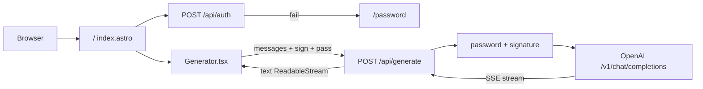
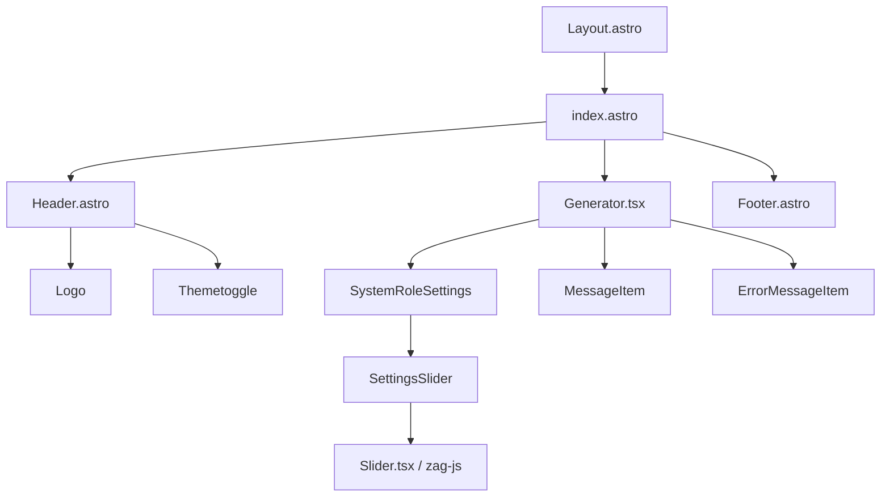

# ChatGPT-API Demo

English | [简体中文](./README.zh-CN.md)

A demo repo based on [OpenAI GPT-3.5 Turbo API.](https://platform.openai.com/docs/guides/chat)

**🍿 Live preview**: https://chatgpt.ddiu.me

> ⚠️ Notice: Our API Key limit has been exhausted. So the demo site is not available now.


## Introducing `Anse`

Looking for multi-chat, image-generation, and more powerful features? Take a look at our newly launched [Anse](https://github.com/anse-app/anse).

More info on https://github.com/ddiu8081/chatgpt-demo/discussions/247.

[](https://github.com/anse-app/anse)

## Running Locally

### Pre environment
1. **Node**: Check that both your development environment and deployment environment are using `Node v18` or later. You can use [nvm](https://github.com/nvm-sh/nvm) to manage multiple `node` versions locally.
   ```bash
    node -v
   ```
2. **PNPM**: We recommend using [pnpm](https://pnpm.io/) to manage dependencies. If you have never installed pnpm, you can install it with the following command:
   ```bash
    npm i -g pnpm
   ```
3. **OPENAI_API_KEY**: Before running this application, you need to obtain the API key from OpenAI. You can register the API key at [https://beta.openai.com/signup](https://beta.openai.com/signup).

### Getting Started

1. Install dependencies
   ```bash
    pnpm install
   ```
2. Copy the `.env.example` file, then rename it to `.env`, and add your [OpenAI API key](https://platform.openai.com/account/api-keys) to the `.env` file.
   ```bash
    OPENAI_API_KEY=sk-xxx...
   ```
3. Run the application, the local project runs on `http://localhost:3000/`
   ```bash
    pnpm run dev
   ```

## Deploy

### Deploy With Vercel

[](https://vercel.com/new/clone?repository-url=https%3A%2F%2Fgithub.com%2Fddiu8081%2Fchatgpt-demo&env=OPENAI_API_KEY&envDescription=OpenAI%20API%20Key&envLink=https%3A%2F%2Fplatform.openai.com%2Faccount%2Fapi-keys)


> #### 🔒 Need website password?
>
> Deploy with the [`SITE_PASSWORD`](#environment-variables)
>
> <a href="https://vercel.com/new/clone?repository-url=https%3A%2F%2Fgithub.com%2Fddiu8081%2Fchatgpt-demo&env=OPENAI_API_KEY&env=SITE_PASSWORD&envDescription=OpenAI%20API%20Key&envLink=https%3A%2F%2Fplatform.openai.com%2Faccount%2Fapi-keys" alt="Deploy with Vercel" target="_blank"></a>


### Deploy With Netlify

[](https://app.netlify.com/start/deploy?repository=https://github.com/ddiu8081/chatgpt-demo#OPENAI_API_KEY=&HTTPS_PROXY=&OPENAI_API_BASE_URL=&HEAD_SCRIPTS=&PUBLIC_SECRET_KEY=&OPENAI_API_MODEL=&SITE_PASSWORD=)

**Step-by-step deployment tutorial:**

1. [Fork](https://github.com/ddiu8081/chatgpt-demo/fork) this project, Go to [https://app.netlify.com/start](https://app.netlify.com/start) new Site, select the project you `forked` done, and connect it with your `GitHub` account.


2. Select the branch you want to deploy, then configure environment variables in the project settings.


3. Select the default build command and output directory, Click the `Deploy Site` button to start deploying the site.


### Deploy with Docker

Environment variables refer to the documentation below. [Docker Hub address](https://hub.docker.com/r/ddiu8081/chatgpt-demo).

**Direct run**
```bash
docker run --name=chatgpt-demo -e OPENAI_API_KEY=YOUR_OPEN_API_KEY -p 3000:3000 -d ddiu8081/chatgpt-demo:latest
```
`-e` define environment variables in the container.


**Docker compose**
```yml
version: '3'

services:
  chatgpt-demo:
    image: ddiu8081/chatgpt-demo:latest
    container_name: chatgpt-demo
    restart: always
    ports:
      - '3000:3000'
    environment:
      - OPENAI_API_KEY=YOUR_OPEN_API_KEY
      # - HTTPS_PROXY=YOUR_HTTPS_PROXY
      # - OPENAI_API_BASE_URL=YOUR_OPENAI_API_BASE_URL
      # - HEAD_SCRIPTS=YOUR_HEAD_SCRIPTS
      # - PUBLIC_SECRET_KEY=YOUR_SECRET_KEY
      # - SITE_PASSWORD=YOUR_SITE_PASSWORD
      # - OPENAI_API_MODEL=YOUR_OPENAI_API_MODEL
```

```bash
# start
docker compose up -d
# down
docker-compose down
```

### Deploy with Sealos

 1.Register a Sealos account for free [sealos cloud](https://cloud.sealos.io)

2.Click  `App Launchpad` button


3.Click `Create Application` button


4.Just fill in according to the following figure, and click on it after filling out `Deploy Application` button


```shell
App Name: chatgpt-demo
Image Name: ddiu8081/chatgpt-demo:latest
CPU: 0.5Core
Memory: 1G
Container Ports: 3000
Accessible to the Public: On
Environment: OPENAI_API_KEY=YOUR_OPEN_API_KEY
```

5.Obtain the access link and click directly to access it. If you need to bind your own domain name, you can also fill in your own domain name in `Custom domain` and follow the prompts to configure the domain name CNAME


6.Wait for one to two minutes and open this link


### Deploy on more servers

Please refer to the official deployment documentation: https://docs.astro.build/en/guides/deploy

## Environment Variables

You can control the website through environment variables.

| Name | Description | Default |
| --- | --- | --- |
| `OPENAI_API_KEY` | Your API Key for OpenAI. | `null` |
| `HTTPS_PROXY` | Provide proxy for OpenAI API. e.g. `http://127.0.0.1:7890` | `null` |
| `OPENAI_API_BASE_URL` | Custom base url for OpenAI API. | `https://api.openai.com` |
| `HEAD_SCRIPTS` | Inject analytics or other scripts before `</head>` of the page | `null` |
| `PUBLIC_SECRET_KEY` | Secret string for the project. Use for generating signatures for API calls | `null` |
| `SITE_PASSWORD` | Set password for site, support multiple password separated by comma. If not set, site will be public | `null` |
| `OPENAI_API_MODEL` | ID of the model to use. [List models](https://platform.openai.com/docs/api-reference/models/list) | `gpt-3.5-turbo` |
| `PUBLIC_MAX_HISTORY_MESSAGES` | Max number of recent messages sent as chat context | `9` |

## Architecture

This is a small, flat Astro SSR app. There is no separate backend, database, or state-management library. Astro owns routing and deploy adapters; SolidJS owns the streaming chat UI; two API routes authenticate and proxy OpenAI Chat Completions.

Coding agents should also read [`AGENTS.md`](./AGENTS.md).

### Tech stack

| Layer | Choice |
| --- | --- |
| Framework | Astro 2 (`output: 'server'`) |
| Interactive UI | SolidJS |
| Styling | UnoCSS (attributify, icons, typography) |
| Markdown | markdown-it + KaTeX + highlight.js |
| Package manager | pnpm 7 |
| Runtime | Node standalone by default; Vercel / Netlify Edge via `OUTPUT` |

### Repository layout

```
chatgpt-demo/
├── src/                         # application code
│   ├── pages/                   # file-based routes (pages + APIs)
│   │   ├── index.astro          # chat page
│   │   ├── password.astro       # site-password gate
│   │   └── api/
│   │       ├── auth.ts          # POST /api/auth
│   │       └── generate.ts      # POST /api/generate
│   ├── components/              # Astro shell + Solid chat UI
│   ├── layouts/Layout.astro     # HTML shell, theme, PWA tags
│   ├── utils/
│   │   ├── openAI.ts            # request payload + SSE parsing
│   │   └── auth.ts              # SHA-256 request signatures
│   └── types.ts                 # ChatMessage / ErrorMessage
├── plugins/disableBlocks.ts     # strips Node-only proxy code on Edge builds
├── hack/                        # Docker entrypoint and env substitution
├── public/                      # PWA icons
├── astro.config.mjs
└── .github/workflows/           # lint, Docker publish, upstream sync
```

Path alias: `@/*` → `src/*`.

### Request flow



1. `/` loads Header, `Generator` (`client:load`), and Footer. A page script sends `localStorage.pass` to `/api/auth` and redirects to `/password` on failure.
2. `Generator` keeps messages, system role, temperature, streaming text, and an `AbortController`. History is stored in `sessionStorage` (default last 9 messages as context).
3. `POST /api/generate` checks `messages`, optional `SITE_PASSWORD`, and (in production) a `PUBLIC_SECRET_KEY` signature of `timestamp:lastMessage:secret`.
4. The server calls `${OPENAI_API_BASE_URL}/v1/chat/completions` with `stream: true`, then `eventsource-parser` turns SSE chunks into a plain-text stream.

`#vercel-disable-blocks` in `generate.ts` wraps `undici` `ProxyAgent` (`HTTPS_PROXY`). The Vite plugin `plugins/disableBlocks.ts` removes that block when `OUTPUT` is `vercel` or `netlify`, because Edge runtimes cannot use the HTTP proxy.

### UI components



- **Astro components** render the static shell: layout, header/footer, theme toggle, logo.
- **`Generator.tsx`** is the page state hub: message list, system role, temperature, streaming, stick-to-bottom scrolling.
- **`MessageItem.tsx`** renders Markdown, code copy, and regenerate on the last assistant message.
- **`SystemRoleSettings.tsx`** can edit the system prompt only before the first message, and exposes a temperature slider (0–2).

### Deploy adapters

`astro.config.mjs` picks an adapter from `OUTPUT`:

| `OUTPUT` | Adapter | Build command |
| --- | --- | --- |
| unset | `@astrojs/node` standalone | `pnpm build` |
| `vercel` | `@astrojs/vercel/edge` | `pnpm build:vercel` |
| `netlify` | `@astrojs/netlify/edge-functions` | `pnpm build:netlify` |

Docker is a multi-stage build. `hack/docker-entrypoint.sh` rewrites env values into the compiled `dist/` files, then starts `node dist/server/entry.mjs`.

Server-only secrets: `OPENAI_API_KEY`, `SITE_PASSWORD`, `HTTPS_PROXY`.  
Values with a `PUBLIC_` prefix are inlined into the client: `PUBLIC_SECRET_KEY` (request signing) and `PUBLIC_MAX_HISTORY_MESSAGES`.

## Enable Automatic Updates

After forking the project, you need to manually enable Workflows and Upstream Sync Action on the Actions page of the forked project. Once enabled, automatic updates will be scheduled every day:


## Frequently Asked Questions

Q: TypeError: fetch failed (can't connect to OpenAI Api)

A: Configure environment variables `HTTPS_PROXY`，reference: https://github.com/ddiu8081/chatgpt-demo/issues/34

Q: throw new TypeError(${context} is not a ReadableStream.)

A: The Node version needs to be `v18` or later, reference: https://github.com/ddiu8081/chatgpt-demo/issues/65

Q: Accelerate domestic access without the need for proxy deployment tutorial?

A: You can refer to this tutorial: https://github.com/ddiu8081/chatgpt-demo/discussions/270

## Contributing

For repository conventions and where to change code, see [`AGENTS.md`](./AGENTS.md).

This project exists thanks to all those who contributed.

Thank you to all our supporters!🙏

[](https://github.com/ddiu8081/chatgpt-demo/graphs/contributors)

## License

MIT © [ddiu8081](https://github.com/ddiu8081/chatgpt-demo/blob/main/LICENSE)
