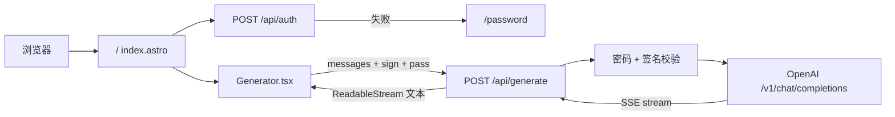
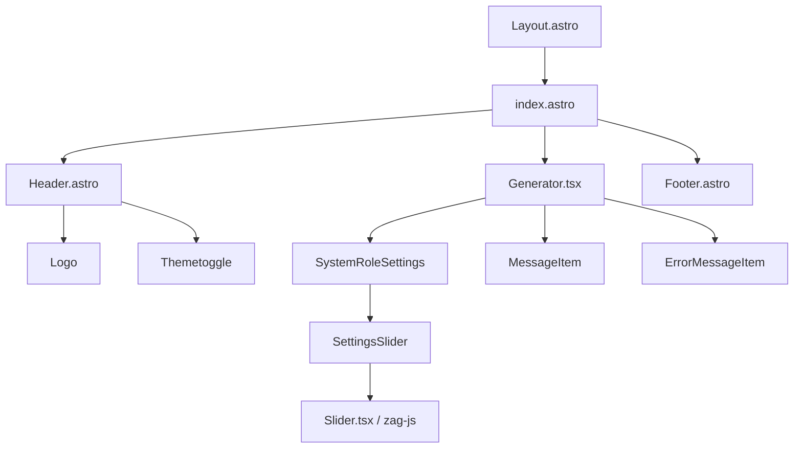

# ChatGPT-API Demo

[English](./README.md) | 简体中文

一个基于 [OpenAI GPT-3.5 Turbo API](https://platform.openai.com/docs/guides/chat) 的 demo。

**🍿 在线预览**: https://chatgpt.ddiu.me

**🏖️ V2 版本 (Beta)**: https://v2.chatgpt.ddiu.me

> ⚠️ 注意：我们的 API 密钥限制已用尽。所以演示站点现在不可用。


## 本地运行

### 前置环境

1. **Node**: 检查您的开发环境和部署环境是否都使用 `Node v18` 或更高版本。你可以使用 [nvm](https://github.com/nvm-sh/nvm) 管理本地多个 `node` 版本。
   ```bash
    node -v
   ```
2. **PNPM**: 我们推荐使用 [pnpm](https://pnpm.io/) 来管理依赖，如果你从来没有安装过 pnpm，可以使用下面的命令安装：
   ```bash
    npm i -g pnpm
   ```
3. **OPENAI_API_KEY**: 在运行此应用程序之前，您需要从 OpenAI 获取 API 密钥。您可以在 [https://beta.openai.com/signup](https://beta.openai.com/signup) 注册 API 密钥。

### 起步运行

1. 安装依赖
   ```bash
    pnpm install
   ```
2. 复制 `.env.example` 文件，重命名为 `.env`，并添加你的 [OpenAI API key](https://platform.openai.com/account/api-keys) 到 `.env` 文件中
   ```bash
    OPENAI_API_KEY=sk-xxx...
   ```
3. 运行应用，本地项目运行在 `http://localhost:3000/`
   ```bash
    pnpm run dev
   ```

## 部署

### 部署在 Vercel

[](https://vercel.com/new/clone?repository-url=https%3A%2F%2Fgithub.com%2Fddiu8081%2Fchatgpt-demo&env=OPENAI_API_KEY&envDescription=OpenAI%20API%20Key&envLink=https%3A%2F%2Fplatform.openai.com%2Faccount%2Fapi-keys)


> ###### 🔒 需要站点密码？
>
> 携带[`SITE_PASSWORD`](#environment-variables)进行部署
>
> <a href="https://vercel.com/new/clone?repository-url=https%3A%2F%2Fgithub.com%2Fddiu8081%2Fchatgpt-demo&env=OPENAI_API_KEY&env=SITE_PASSWORD&envDescription=OpenAI%20API%20Key&envLink=https%3A%2F%2Fplatform.openai.com%2Faccount%2Fapi-keys" alt="Deploy with Vercel" target="_blank"></a>


### 部署在 Netlify

[](https://app.netlify.com/start/deploy?repository=https://github.com/ddiu8081/chatgpt-demo#OPENAI_API_KEY=&HTTPS_PROXY=&OPENAI_API_BASE_URL=&HEAD_SCRIPTS=&PUBLIC_SECRET_KEY=&OPENAI_API_MODEL=&SITE_PASSWORD=)

**分步部署教程：**

1. [Fork](https://github.com/ddiu8081/chatgpt-demo/fork) 此项目，前往 [https://app.netlify.com/start](https://app.netlify.com/start) 新建站点，选择你 `fork` 完成的项目，将其与 `GitHub` 帐户连接。


2. 选择要部署的分支，选择 `main` 分支，在项目设置中配置环境变量，环境变量配置参考下文。


3. 选择默认的构建命令和输出目录，单击 `Deploy Site` 按钮开始部署站点。


### 部署在 Docker
部署之前请确认 `.env` 文件正常配置，环境变量参考下方文档，[Docker Hub address](https://hub.docker.com/r/ddiu8081/chatgpt-demo).

**一键运行**
```bash
docker run --name=chatgpt-demo -e OPENAI_API_KEY=YOUR_OPEN_API_KEY -p 3000:3000 -d ddiu8081/chatgpt-demo:latest
```
`-e` 在容器中定义环境变量。

**使用 Docker compose**
```yml
version: '3'

services:
  chatgpt-demo:
    image: ddiu8081/chatgpt-demo:latest
    container_name: chatgpt-demo
    restart: always
    ports:
      - '3000:3000'
    environment:
      - OPENAI_API_KEY=YOUR_OPEN_API_KEY
      # - HTTPS_PROXY=YOUR_HTTPS_PROXY
      # - OPENAI_API_BASE_URL=YOUR_OPENAI_API_BASE_URL
      # - HEAD_SCRIPTS=YOUR_HEAD_SCRIPTS
      # - PUBLIC_SECRET_KEY=YOUR_SECRET_KEY
      # - SITE_PASSWORD=YOUR_SITE_PASSWORD
      # - OPENAI_API_MODEL=YOUR_OPENAI_API_MODEL
```

```bash
# start
docker compose up -d
# down
docker-compose down
```

### Sealos 部署

 1.注册 Sealos 免费账号 [sealos cloud](https://cloud.sealos.io)

2.点击  `App Launchpad` 按钮


3.点击 `Create Application` 按钮


4.按照下图填写后，点击 `Deploy Application` 按钮


```shell
App Name: chatgpt-demo
Image Name: ddiu8081/chatgpt-demo:latest
CPU: 0.5Core
Memory: 1G
Container Ports: 3000
Accessible to the Public: On
Environment: OPENAI_API_KEY=YOUR_OPEN_API_KEY
```

5.获取访问链接。如果你需要自定义域名，可以点击 `Custom domain` 按钮后按照提示解析域名 CNAME


6.等待 1-2 分钟后点击链接，即可进去页面


### 部署在更多的服务器

请参考官方部署文档：https://docs.astro.build/en/guides/deploy

## 环境变量

配置本地或者部署的环境变量

| 名称 | 描述 | 默认 |
| --- | --- | --- |
| `OPENAI_API_KEY` | 你的 OpenAI API Key | `null` |
| `HTTPS_PROXY` | 为 OpenAI API 提供代理。e.g. `http://127.0.0.1:7890` | `null` |
| `OPENAI_API_BASE_URL` | 请求 OpenAI API 的自定义 Base URL. | `https://api.openai.com` |
| `HEAD_SCRIPTS` | 在页面的 `</head>` 之前注入分析或其他脚本 | `null` |
| `PUBLIC_SECRET_KEY` | 项目的秘密字符串。用于生成 API 调用的签名 | `null` |
| `SITE_PASSWORD` | 为网站设置密码，支持使用英文逗号创建多个密码。如果未设置，则该网站将是公开的 | `null` |
| `OPENAI_API_MODEL` | 使用的 OpenAI 模型。[模型列表](https://platform.openai.com/docs/api-reference/models/list) | `gpt-3.5-turbo` |
| `PUBLIC_MAX_HISTORY_MESSAGES` | 作为上下文发送的最近消息条数上限 | `9` |

## 代码结构

这是一个扁平的 Astro SSR 应用，没有独立 backend、数据库或状态管理库。Astro 负责路由和部署适配，SolidJS 负责流式对话 UI，两个 API 路由做鉴权并转发 OpenAI Chat Completions。

面向编码 Agent 的约定见 [`AGENTS.md`](./AGENTS.md)。

### 技术栈

| 层 | 选择 |
| --- | --- |
| 框架 | Astro 2（`output: 'server'`） |
| 交互 UI | SolidJS |
| 样式 | UnoCSS（attributify + 图标 + typography） |
| Markdown | markdown-it + KaTeX + highlight.js |
| 包管理 | pnpm 7 |
| 运行时 | 默认 Node standalone；可通过 `OUTPUT` 切到 Vercel / Netlify Edge |

### 目录结构

```
chatgpt-demo/
├── src/                         # 全部应用代码
│   ├── pages/                   # 文件路由：页面 + API
│   │   ├── index.astro          # 聊天主页
│   │   ├── password.astro       # 站点密码页
│   │   └── api/
│   │       ├── auth.ts          # POST /api/auth
│   │       └── generate.ts      # POST /api/generate
│   ├── components/              # Astro 壳 + Solid 聊天 UI
│   ├── layouts/Layout.astro     # HTML 骨架、主题、PWA
│   ├── utils/
│   │   ├── openAI.ts            # 请求体与 SSE 解析
│   │   └── auth.ts              # SHA-256 请求签名
│   └── types.ts                 # ChatMessage / ErrorMessage
├── plugins/disableBlocks.ts     # Edge 构建时裁掉 Node 代理代码
├── hack/                        # Docker 启动与环境变量替换
├── public/                      # PWA 图标
├── astro.config.mjs
└── .github/workflows/           # lint、Docker 发布、上游同步
```

路径别名：`@/*` → `src/*`。

### 请求链路



1. `/` 加载 Header、`Generator`（`client:load`）和 Footer。页面脚本用 `localStorage.pass` 请求 `/api/auth`，失败则跳到 `/password`。
2. `Generator` 维护消息列表、system role、temperature、流式输出和 `AbortController`。会话存在 `sessionStorage`（默认只带最近 9 条作为上下文）。
3. `POST /api/generate` 校验 `messages`、可选的 `SITE_PASSWORD`，以及生产环境下 `PUBLIC_SECRET_KEY` 对 `timestamp:lastMessage:secret` 的签名。
4. 服务端请求 `${OPENAI_API_BASE_URL}/v1/chat/completions`（`stream: true`），再用 `eventsource-parser` 把 SSE 转成纯文本流。

`generate.ts` 里 `#vercel-disable-blocks` 包住的是 `undici` 的 `ProxyAgent`（`HTTPS_PROXY`）。当 `OUTPUT` 为 `vercel` 或 `netlify` 时，Vite 插件 `plugins/disableBlocks.ts` 会裁掉这段，因为 Edge 运行时不支持该 HTTP 代理。

### 前端组件



- **Astro 组件**：静态壳（布局、页头页脚、主题切换、Logo）。
- **`Generator.tsx`**：整页状态中心，负责消息列表、system role、temperature、流式输出、贴底滚动。
- **`MessageItem.tsx`**：Markdown 渲染、代码复制，以及最后一条 assistant 消息的重试。
- **`SystemRoleSettings.tsx`**：仅在还没有任何消息时可编辑 system prompt，并调节 temperature（0–2）。

### 部署适配

`astro.config.mjs` 用 `OUTPUT` 选择适配器：

| `OUTPUT` | 适配器 | 构建命令 |
| --- | --- | --- |
| 未设置 | `@astrojs/node` standalone | `pnpm build` |
| `vercel` | `@astrojs/vercel/edge` | `pnpm build:vercel` |
| `netlify` | `@astrojs/netlify/edge-functions` | `pnpm build:netlify` |

Docker 为多阶段构建。`hack/docker-entrypoint.sh` 会把环境变量写入编译后的 `dist/`，再启动 `node dist/server/entry.mjs`。

仅服务端使用的密钥：`OPENAI_API_KEY`、`SITE_PASSWORD`、`HTTPS_PROXY`。  
带 `PUBLIC_` 前缀的会进客户端：`PUBLIC_SECRET_KEY`（请求签名）、`PUBLIC_MAX_HISTORY_MESSAGES`。

## 开启同步更新

Fork 项目后，您需要在 Fork 项目的操作页面上手动启用工作流和上游同步操作。启用后，每天都会执行自动更新：


## 常见问题

Q: TypeError: fetch failed (can't connect to OpenAI Api)

A: 配置环境变量 `HTTPS_PROXY`，参考：https://github.com/ddiu8081/chatgpt-demo/issues/34

Q: throw new TypeError(${context} is not a ReadableStream.)

A: Node 版本需要在 `v18` 或者更高，参考：https://github.com/ddiu8081/chatgpt-demo/issues/65

Q: Accelerate domestic access without the need for proxy deployment tutorial?

A: 你可以参考此教程：https://github.com/ddiu8081/chatgpt-demo/discussions/270

## 参与贡献

仓库约定和改代码的入口见 [`AGENTS.md`](./AGENTS.md)。

这个项目的存在要感谢所有做出贡献的人。

感谢我们所有的支持者！🙏

[](https://github.com/ddiu8081/chatgpt-demo/graphs/contributors)

## License

MIT © [ddiu8081](https://github.com/ddiu8081/chatgpt-demo/blob/main/LICENSE)
